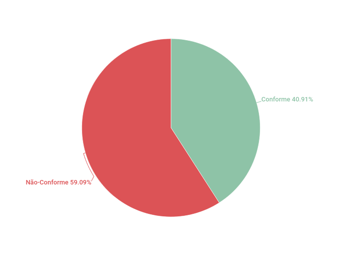

# Relato dos resultados do StoryBoard

## 1. Introdução

&emsp;&emsp; Este artefato é destinado para a inspeção do artefato [Planejamento do relato dos resultados do StoryBoard](../../DesignAvalDesenv/nivel1/storyboard/relato_resultados.md) e [Aula 12](https://aprender3.unb.br/course/view.php?id=16386) cujo tema é Storyboard, Análise de tarefas e Planejamento da Avaliação.

## 2. Metodologia

&emsp;&emsp; O checklist foi concebido seguindo como base as informações presentes no livro de [Interação Humano-Computador e Experiência do Usuário de Simone Barbosa](https://www.amazon.com.br/Intera%C3%A7%C3%A3o-Humano-Computador-Simone-Junqueira-Barbosa/dp/8535234187), cujo tema é Planejamento da Avaliação de IHC.

## 3. Inspeção

### 3.1 Inspeção 1

| ID | Descrição | Avaliação | Problema | Correção | Observações |
|----|-----------|-----------|----------|----------|-------------|
| 01 | O artefato possui introdução? | ✅ | - | - | - |
| 02 | O artefato possui metodologia? | ✅ | - | - | - |
| 03 | O artefato possui a execução da metodologia? | ✅ | - | - | - |
| 04 | O artefato possui o referências? |✅| - | - | - |
| 05 | O artefato possui histórico de versão padronizado? | ✅ | - | - | - |
| 06 | O artefato possui os autores? | ✅  | - | - | - |
| 07 | O artefato possui os revisores? | ✅  | - | - | - |
| 08 | O artefato descreve as funcionalidades ? | ✅ |- | - | - |
| 09 | O artefato possui tabela ? | ❌ |- | - | Adicionar tabela |
| 10 | A tabela do artefato está corretamente estuturada ? | ❌ |- | - | Adicionar tabela |
| 11 | Os objetivos da avaliação está definido ? | ✅ | - | - | - |
| 12 | O escopo da avaliação está definido ? | ❌ | - | Definir o escopo da avaliação | - |
| 13 | O método de avaliação empregado está definido ? | ❌ | - | Definir o método da avaliação | - |
| 14 | O número de usuários que participaram da avaliação está definido ? | ❌ | - | Definir o número de usuários que participaram da avaliação  | - |
| 15 | O perfil de usuários que participaram da avaliação está definido ? | ❌ | - | Definir o perfil de usuários que participaram da avaliação  | - |
| 16 | O número de avaliadores que participaram da avaliação está definido ? | ❌ | - | Definir o número de avaliadores que participaram da avaliação  | - |
| 17 | O perfil de avaliadores que participaram da avaliação está definido ? | ❌ | - | Definir o perfil de avaliadores que participaram da avaliação  | - |
| 18 | O artefato possui gráfico ? | ❌ |- | Adicionar gráfico |  - |
| 19 | O artefato possui relatório da interpretação dos dados ? | ❌ |- | Adicionar relatório da interpretação dos dados |  - |
| 20 | O artefato possui análise dos dados ? | ❌ |- | Adicionar análise dos dados |  - |
| 21 | O artefato possui uma lista de problemas encontrados ? | ❌ |- | Adicionar uma lista de problemas encontrados |  - |
| 22 | O artefato possui planejamento para o reprojeto do sistema ? | ❌ | - | Adicionar planejamento para o reprojeto do sistema | - |

<figcaption align='center'>
    <b>Checklist da inspeção do cronograma de atividades do artefato
</b>
         <small>Autor: Rodolfo Cabral Neves</small>
</figcaption> 

#### 3.1.1 Acompanhamento inspeção 1

&emsp;&emsp; Portanto, o resultado do checklist deste artefato foi:

  - ✅: 9 artefatos conforme
  - ❌: 13 artefatos não conforme

<figcaption align='center'>
    <b>Gráfico de pizza</b>
         <small>Autor: Rodolfo Cabral Neves</small>
</figcaption>

## 4. Referências

-  [Aula 12](https://aprender3.unb.br/course/view.php?id=16386)
- [Planejamento do relato dos resultados do StoryBoard](../../DesignAvalDesenv/nivel1/storyboard/relato_resultados.md)

## 5. Histórico de versão

| Versão | Data da realização | Data prevista revisão | Descrição | Autor | Revisor |
|--------|------|------|-----------|-------|---------|
| 1.0    | 16/01/2023 | 18/01/2023 | Criação da página e adição da introdução, metodologia e execução | Rodolfo Cabral Neves | Milena Aires |