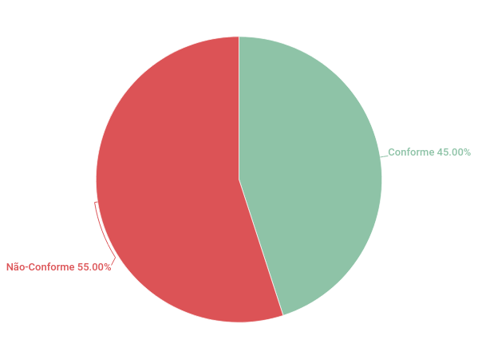

# Verificação do Planejamento da Avaliação do Protótipo de Papel

## 1. Introdução

&emsp;&emsp; Este artefato é destinado para a inspeção do artefato [Planejamento da Avaliação do Protótipo de Papel](../DesignAvalDesenv/nivel2/planeja_protopapel.md).

## 2. Metodologia

&emsp;&emsp; O checklist foi concebido seguindo como base as informações presentes no livro de [Interação Humano-Computador e Experiência do Usuário de Simone Barbosa](https://www.amazon.com.br/Intera%C3%A7%C3%A3o-Humano-Computador-Simone-Junqueira-Barbosa/dp/8535234187), cujo tema é Planejamento da Avaliação de IHC.

## 3. Inspeção

### 3.1 Inspeção 1

| ID | Descrição | Avaliação | Problema | Correção | Observações |
|----|-----------|-----------|----------|----------|-------------|
| 01 | O artefato possui introdução? | ✅ | - | - | - |
| 02 | O artefato possui metodologia? | ✅ | - | - | - |
| 03 | O artefato possui a execução da metodologia? | ✅ | - | - | - |
| 04 | O artefato possui o referências? |✅| - | - | - |
| 05 | O artefato possui histórico de versão padronizado? | ✅ | - | - | - |
| 06 | O artefato possui os autores? | ✅  | - | - | - |
| 07 | O artefato possui os revisores? | ✅  | - | - | - |
| 08 | O artefato descreve os objetivos ? | ✅  |- | - | - |
| 09 | O artefato descreve o escopo da avaliação ? | ❌ |- | Descrever o escopo da avaliação | - |
| 10 | O artefato descreve o método da avaliação ? | ✅ |- | - | - |
| 11 | O artefato apresenta o número dos avaliadores ? | ❌ |- | Apresentar o número dos avaliadores  | - |
| 12 | O artefato apresenta o perfil dos avaliadores ? | ❌ |- | Apresentar o perfil dos avaliadores | - |
| 13 | O artefato apresenta o perfil dos usuários avaliados ? | ❌ |- | Apresentar o perfil dos usuários avaliados | - |
| 14 | O artefato apresenta o número dos usuários avaliados ? | ❌ |- | Apresentar o número dos usuários avaliados | - |
| 15 | O artefato apresenta um sumário dos dados coletados ? | ❌ |- | Apresentar um sumário dos dados coletados | - |
| 16 | O artefato apresenta as atividades que os usuários terão ? | ❌ |- | Apresenta as atividades que os usuários terão | - |
| 17 | O artefato descreve o teste-piloto ? | ❌ |- | Descrever o teste-piloto | - |
| 18 | O artefato apresenta a execução o teste-piloto ? | ❌ |- | Apresentar a execução o teste-piloto | - |
| 19 | O artefato lista os problemas encontrados ? | ❌ |- | Listar os problemas encontrados | - |
| 20 | O artefato sugere correções ? | ❌ |- | Sugerir correções | - |

<figcaption align='center'>
    <b>Checklist da inspeção do cronograma de atividades do artefato
</b>
         <small>Autor: Rodolfo Cabral Neves</small>
</figcaption> 

#### 3.1.1 Acompanhamento inspeção 1

&emsp;&emsp; Portanto, o resultado do checklist deste artefato foi:

  - ✅: 9 artefatos conforme
  - ❌: 11 artefatos não conforme
  - ➖: 0 artefatos incompletos

<figcaption align='center'>
    <b>Gráfico de pizza</b>
         <small>Autor: Rodolfo Cabral Neves</small>
</figcaption>

## 4. Bibliografia

 - [Interação Humano-Computador e Experiência do Usuário de Simone Barbosa](https:/www.amazon.com.br/Intera%C3%A7%C3%A3o-Humano-Computador-Simone-Junqueira-Barbosa/dp/8535234187)

## 5. Histórico de versão

| Versão | Data da realização | Data prevista revisão | Descrição | Autor | Revisor |
|--------|------|------|-----------|-------|---------|
| 1.0    | 24/01/2023 | 24/01/2023 | Adicionar a Verificação do Planejamento da Avaliação do Protótipo de Papel | Rodolfo Cabral Neves | Milena Aires |
| 1.1    | 31/01/2023 | 01/02/2023 | Melhoria do artefato | Rodolfo Cabral Neves | Milena Aires |
