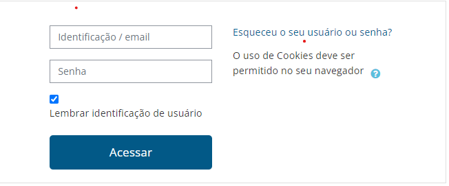
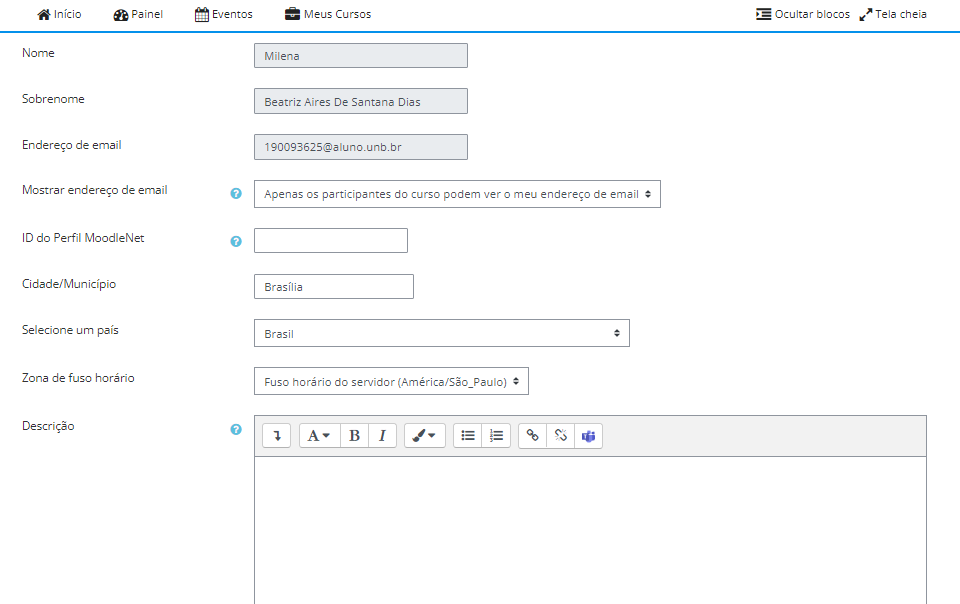
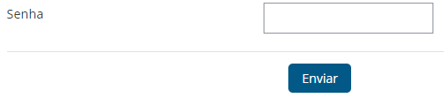
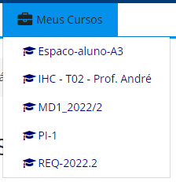
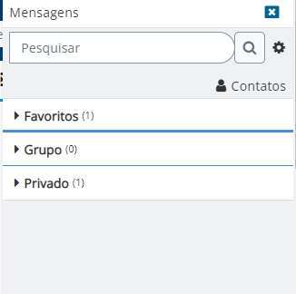
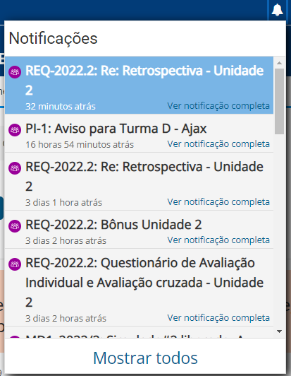
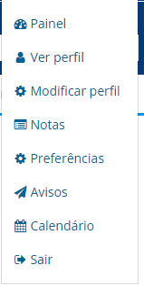
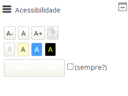

# 
Guia de Estilo

## 1. Introdução
Este guia de estilo visa reunir princípios e diretrizes através de uma documentção. É documentada as decisões de design de forma que sejam utilizadas no processo de contrução do produto final em difentes ambiente, como por exemplo a plataforma utilizada.

### 1.1 Objetivo
O guia de estilo tem como objetivo principal a comunicação entre equipes de design e equipes de desenvolvimento do produto. Sendo assim, de grande relevância que o guia de estilo esteja de fácil entendimento para consultas sobre próximas versões e extensões do produto.

### 1.2 Organização e conteúdo
A organização desse guia de estilo será baseada nas estruturas recomendadas por Marcus (1992) e Mayhem (1999).
 
### 1.3 Público-alvo
O público-alvo deste guia de estilo é a equipe de avaliadores, desenvolvedores, suporte e de design do website, assim como os integrantes do <a href="https://interacao-humano-computador.github.io/2022.2-Aprender3/#sobre-o-projeto">Grupo 7 (Aprender3)</a> que utilizarão o guia para fututos desenvolvimentos e documentações.
 
### 1.4 Como utilizar
Para utilizar este guia, basta seguir os tópicoe informações disponibilizadas. Utilizando sempre os elementos citados e seguindo as regras necessárias propostas nele.
 
### 1.5 Como manter
Para manter o guia, deve-se levar em conta os fundamentos de IHC para obter uma usabilidade de qualidade. Este guida visa melhorar a plataforma utilzando fundamentos e conhecimentos nesta área. Mesmo realizando refatorações neste documento, estas mudanças seguirem os princípios básicos, é o caminho correto. Caso contrário precise de material para se aprofundar neste conteúdo, verifique osconteúdos citados no tópico de bibliografia do final do documento. 
 
## 2. Resultados de análise
 
 
## 3. Elementos de interface
 
 
## 4. Elementos de interação
 
 
## 5. Elementos de ação
Neste tópico será apresentado os elementos de ação presentes na plataforma <a href="https://aprender3.unb.br/login/index.php">Aprender 3</a>.

### 5.1 Preenchimento de campos
A finalidade é de que o usuário possa preencher com informações para atingir um objeitov, fazer alguma alteração e até mesmo com informações pessoais.
 
#### 5.1.1 Login na plataforma
O primeiro preenchimento de campo que observamos é logo ao entrar na plataforma que já é solicitado o login do usuário antes de ter acesso a qualquer informação.
 
 
 
 <figcaption align="center">Figura 1 - login Aprender3, Fonte (Apredender3, 2022)</figcaption>
 
#### 5.1.2 Procursa de turmas 
Já dentro da plataforma, existe um campo em que é possível procurar por uma turma/ disciplina desejada. 
 
 
 
 <figcaption align="center">Figura 2 - procura de turmas Aprender3, Fonte (Apredender3, 2022)</figcaption>
 
### 5.1.3 Modificar Perfil 
Na plataforma é possível encontrar diversos campos disponíveis para o usuário modificar seu perfil, como por exemplo: nome, sobrenome, endereço de email, etc.
 
 
 
 <figcaption align="center">Figura 3 - modificar perfil Aprender3, Fonte (Apredender3, 2022)</figcaption>
 
#### 5.1.4 Senha
Para se matricular em uma turma é exigido uma senha que é disponibilizada pelo docente da disciplina.
 
 
 
 <figcaption align="center">Figura 4 - senha para matrícula em turma Aprender3, Fonte (Apredender3, 2022)</figcaption>
 
### 5.2 Seleção
As opções de seleção e opções da plataforma disponíveis para o usuário.
 
#### 5.2.1 Menu 
Logo na página inicial há um menu de seleções onde posso selicionar: início, painel, eventos e meus cursos.
 
 
 
 <figcaption align="center">Figura 5 - menu Aprender3, Fonte (Apredender3, 2022)</figcaption>
 
#### 5.2.2 Meus cursos
Apertando meus cursos no menu de seleção obtemos as turmas cadastradas do usuário onde é possível selecioná-las.
 
 
 
 <figcaption align="center">Figura 6 - menu de cursos Aprender3, Fonte (Apredender3, 2022)</figcaption>
 
#### 5.2.3 Chat
É possível selecionar um chat de mensagens com outros usuários na plataforma.
 
  
 
 <figcaption align="center">Figura 7 - chat Aprender3, Fonte (Apredender3, 2022)</figcaption>
 
#### 5.2.4 Linguagem
É possível selecionar a linguagem que o usuário deseja na plataforma dentre as opções possíveis.
 
 
 
 <figcaption align="center">Figura 8 - linguagem Aprender3, Fonte (Apredender3, 2022)</figcaption>
 
#### 5.2.5 Notificações
O usuário recebe uma notificação sempre que algo é alterado ou adicionado nas turmas em que faz parte, e assim selecionar a notificação desejada que irá ser exibida pela plataforma.
 
 
 
 <figcaption align="center">Figura 9 - notificações Aprender3, Fonte (Apredender3, 2022)</figcaption>
 
#### 5.2.6 Opções do perfil
Quando é selecionado o perfil, é aberto um menu de diversas seleções que o usuário pode interagir.
 
 
 
 <figcaption align="center">Figura 10 - opções do perfil Aprender3, Fonte (Apredender3, 2022)</figcaption>
 
 
### 5.3 Confirmação
As ações de confirmação está indiretamente ligadas com as ação de campos de preenchimento.
Como citado acima, é visível que na _figura 1_ de login na plataforma, é preciso confirmar logo após preencher os campos de login para dar continuidade a ação. Como também na _figura 4_ para confirmar a senha é preciso apertar o botão e assim se sucede por toda a plataforma.
 
## 6.  Vocabulário e padrões
### 6.1 Terminologia
 
### 6.2 Tela 
A plataforma dá liberdade para que o usuário escolha a tela padrão de sua preferência, escolhendo tamanho da fonte e uma paleta de cores.
 
 
 
 <figcaption align="center">Figura 11 - acessibilidade Aprender3, Fonte (Apredender3, 2022)</figcaption>
 
## 7. Bibliografia
> Barbosa, S. D. J.; Silva, B. S. da; Silveira, M. S.; Gasparini, I.; Darin, T.; Barbosa, G. D. J. (2021) Interação Humano-Computador e Experiência do usuário. Autopublicação. ISBN: 978-65-00-19677-1.

## 8. Histórico de Versão
 
| Data       | Versão | Descrição            | Autor             | Revisor |
|:----------:|:------:|:--------------------:|:-----------------:|:-------:|
| 09.12.2022 | 1.0 | Criação do arquivo |   Milena Aires      | Raphaela guimarães |
| 11.12.2022 | 1.1 | Adicição do tópico de introdução e elementos de seleção | Milena Aires | Raphaela Guimarães |
 
